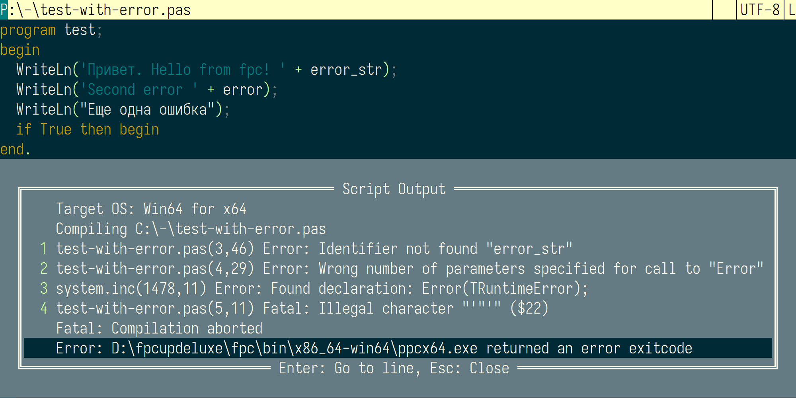

# SaveAndRun - Lua Script for Far Manager

[Русская версия README](readme.ru.md)

SaveAndRun is a Lua script for Far Manager that executes commands based on the file extension of the edited file, as defined in a configuration file. It displays the command's output (stdout and stderr) in a menu, allowing navigation to error lines in the editor. Additionally, it supports file formatting with configurable tools.

## Features

- Executes commands specified in a `.SaveAndRun.toml` configuration file, triggered by a key press.
- Supports different commands based on file extensions (e.g., `.py`, `.js`, `.pas`).
- Displays command output (stdout and stderr) in a menu, with error line and column parsing for quick navigation.
- Saves the current file before executing commands.
- Supports file formatting with tools like Prettier or ruff, with error handling.
- Handles output encoding conversion using `iconv.exe` (configurable).
- Stores output in temporary files for further analysis.

## Installation

1. Place the `editor.dea.SaveAndRun.lua` script in `%FARPROFILE%\Macros\scripts`.
2. Create a `.SaveAndRun.toml` configuration file in the same directory or the directory of the edited file.
3. Run `macro:load` in Far Manager to load the macro.

## Configuration

The script looks for a `.SaveAndRun.toml` file in:
1. The directory of the edited file.
2. The script's directory (if not found in the file's directory).

If no configuration is found, it defaults to running `python <filename>`.

### Configuration File Format

The configuration is a TOML file with sections for each file extension. Each section can include:

- `run`: Command to execute, with `$file` placeholder for the file name.
- `pattern`: Regular expression to extract error line (and optionally column) numbers from output.
- `encoding`: Source encoding for output conversion to UTF-8 (requires `iconv.exe`).
- `format`: Command for formatting the file.
- `formatpattern`: Regular expression for parsing formatting errors.

#### Example Configuration

```toml
[py]
run = python $file
pattern = line (%d+)

[js]
run = node.exe $file
pattern = :(%d+):(%d+)
format = prettier --write --no-color --tab-width 3 $file
formatpattern = (%d+):(%d+)

[pas]
run = D:\Utils\fpc.cmd $file
pattern = %((%d+),(%d+)%)
```

### Key Bindings

- **Shift+Enter**: Saves the file and runs the configured `run` command.
- **Ctrl+D**: Saves the file and runs the configured `format` command.

## How It Works

### Command Execution

1. The script saves the current file.
2. It determines the file extension (e.g., `py` for `.py` files).
3. It reads the `.SaveAndRun.toml` file and locates the section matching the extension (e.g., `[py]`).
4. The `run` command is executed, with `$file` replaced by the file name.
5. If `encoding` is specified, output is converted from the specified encoding to UTF-8 using `iconv.exe`.
6. Output (stdout and stderr) is saved to temporary files (`%TEMP%\sr.stdout.txt` and `%TEMP%\sr.stderr.txt`).
7. The output is displayed in a menu, with errors numbered for quick selection.
8. The `pattern` is used to extract line (and optionally column) numbers from error messages.
9. Selecting an error in the menu navigates to the corresponding line (and column, if available) in the editor.
10. Selecting the first menu item (exit code) jumps to the first error, if any.

### Advanced Command Usage

- Commands can include batch files (`.cmd`) or chained commands using `&` or `&&`.
- Example: `run = eslint $file & node $file` runs ESLint followed by Node.js.


### File Formatting

1. The script saves the current file.
2. It runs the `format` command specified in the configuration.
3. If the command succeeds (exit code 0), the file is reloaded in the editor.
4. If it fails, errors are displayed in a menu, parsed using `formatpattern`, allowing navigation to error locations.


### Example: Setting Up Prettier for JavaScript

1. Install Prettier: `npm install -g prettier`.
2. Add to `.SaveAndRun.toml`:

```toml
[js]
format = prettier --write --no-color --tab-width 3 $file
formatpattern = (%d+):(%d+)
```

3. Press **Ctrl+D** to format `.js` files.

## Screenshots



The screenshot shows the output menu with numbered errors. Pressing a number (e.g., `1`) jumps to the corresponding error line.

## Changelog

- **2025-05-02**: Fixed configuration file search for long paths.
- **2025-04-20**: Initial release.

## Author

- phidel

## Support

Discuss the macro on the [Far Manager Forum](https://forum.farmanager.com/viewtopic.php?t=13629).
