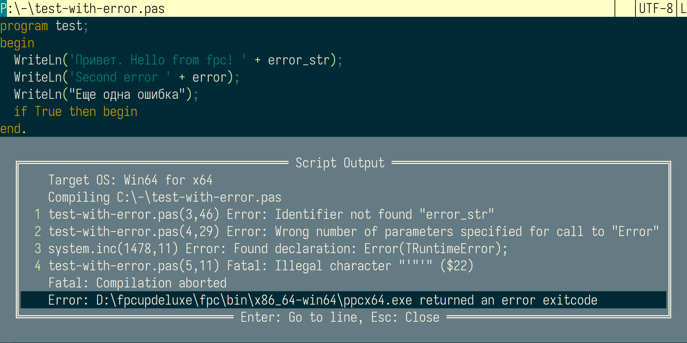

# SaveAndRun - Lua-скрипт для Far Manager

[English version of README](readme.md)

SaveAndRun — это Lua-скрипт для Far Manager, который выполняет команды в зависимости от расширения редактируемого файла, указанного в конфигурационном файле. Он отображает вывод команды (stdout и stderr) в меню, позволяя переходить к строкам с ошибками в редакторе. Кроме того, поддерживает форматирование файлов с использованием настраиваемых инструментов.

## Возможности

- Выполняет команды, указанные в конфигурационном файле `.SaveAndRun.toml`, по нажатию клавиши.
- Поддерживает различные команды в зависимости от расширений файлов (например, `.py`, `.js`, `.pas`).
- Отображает вывод команды (stdout и stderr) в меню с разбором строк и столбцов ошибок для быстрого перехода.
- Сохраняет текущий файл перед выполнением команд.
- Поддерживает форматирование файлов с помощью инструментов, таких как Prettier или ruff, с обработкой ошибок.
- Поддерживает линтинг.
- Обрабатывает преобразование кодировки вывода с помощью `iconv.exe` (настраивается).
- Сохраняет вывод во временные файлы для дальнейшего анализа.

## Установка

1. Поместите скрипт `editor.dea.SaveAndRun.lua` в `%FARPROFILE%\Macros\scripts`.
2. Создайте конфигурационный файл `.SaveAndRun.toml` в той же директории или в директории редактируемого файла.
3. Выполните `macro:load` в Far Manager для загрузки макроса.

## Конфигурация

Скрипт ищет файл `.SaveAndRun.toml` в:
1. Директории редактируемого файла.
2. Директории скрипта (если файл не найден в директории файла).

Если конфигурация не найдена, используется команда по умолчанию `python <filename>`.

### Формат конфигурационного файла

Конфигурация — это TOML-файл с секциями для каждого расширения файла. Каждая секция может включать:

- `run`: Команда для выполнения, с заполнителем `$file` для имени файла.
- `pattern`: Регулярное выражение для извлечения номеров строк (и, при необходимости, столбцов) из вывода.
- `encoding`: Исходная кодировка для преобразования вывода в UTF-8 (требуется `iconv.exe`).
- `format`: Команда для форматирования файла.
- `formatpattern`: Регулярное выражение для разбора ошибок форматирования.
- `linting`: Команда для линтинга.
- `lintingpattern`: Регулярное выражение для разбора ошибок линтинга.


#### Пример конфигурации

```toml
[py]
run = python $file
pattern = line (%d+)

[js]
run = node.exe $file
pattern = :(%d+):(%d+)
format = prettier --write --no-color --tab-width 3 $file
formatpattern = (%d+):(%d+)

[pas]
run = D:\Utils\fpc.cmd $file
pattern = %((%d+),(%d+)%)
```


### Горячие клавиши

- **Shift+Enter**: Сохраняет файл и выполняет команду `run`.
- **Ctrl+D**: Сохраняет файл и выполняет команду `format`.
- **Alt+Enter**: Сохраняет файл и выполняет команду `linting`.

## Как это работает

### Выполнение команд

1. Скрипт сохраняет текущий файл.
2. Определяет расширение файла (например, `py` для `.py`).
3. Читает файл `.SaveAndRun.toml` и находит секцию, соответствующую расширению (например, `[py]`).
4. Выполняется команда `run`, где `$file` заменяется на имя файла.
5. Если указана `encoding`, вывод преобразуется из указанной кодировки в UTF-8 с помощью `iconv.exe`.
6. Вывод (stdout и stderr) сохраняется во временные файлы (`%TEMP%\sr.stdout.txt` и `%TEMP%\sr.stderr.txt`).
7. Вывод отображается в меню, ошибки нумеруются для быстрого выбора.
8. Регулярное выражение `pattern` извлекает номера строк (и, при необходимости, столбцов) из сообщений об ошибках.
9. Выбор ошибки в меню переводит курсор на соответствующую строку (и столбец, если доступно) в редакторе.
10. Выбор первого пункта меню (код завершения) переходит к первой ошибке, если она есть.

### Расширенное использование команд

- Команды могут включать пакетные файлы (`.cmd`) или цепочки команд с использованием `&` или `&&`.
- Пример: `run = eslint $file & node $file` запускает ESLint, а затем Node.js.

### Форматирование файлов

1. Скрипт сохраняет текущий файл.
2. Выполняется команда `format`, указанная в конфигурации.
3. Если команда выполнена успешно (код выхода 0), файл перезагружается в редакторе.
4. Если команда завершилась с ошибкой, ошибки отображаются в меню, разобранные с помощью `formatpattern`, с возможностью перехода к местам ошибок.


### Пример: Настройка Prettier для JavaScript

1. Установите Prettier: `npm install -g prettier`.
2. Добавьте в `.SaveAndRun.toml`:

```toml
[js]
format = prettier --write --no-color --tab-width 3 $file
formatpattern = (%d+):(%d+)
```

3. Нажмите **Ctrl+D** для форматирования `.js`-файлов.

## Скриншоты



Скриншот показывает меню вывода с пронумерованными ошибками. Нажатие номера (например, `1`) переводит к соответствующей строке ошибки.

## История изменений

- **2025-05-08**: Добавлена поддержка линтинга.
- **2025-05-02**: Исправлен поиск конфигурационного файла для длинных путей.
- **2025-04-20**: Первоначальный выпуск.

## Автор

- phidel

## Поддержка

Обсудите макрос на [форуме Far Manager](https://forum.farmanager.com/viewtopic.php?t=13629).
